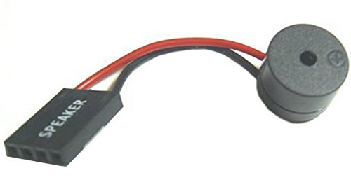

# EROR BEEP PADA KOMPUTER

disusun oleh: Alif Budiman Wahabbi

---

---

# Macam-macam Bunyi Beep, Arti dan Cara Mengatasinya

Kadang-kadang ada beberapa orang yang pernah mendengar suara beep pada PC, namun mereka tidak memahami arti dari bunyi beep tersebut. Hal ini membuat mereka kesulitan ketika ada kerusakan pada PC dan tidak tahu apa yang harus dicari untuk mengetahui penyebabnya. Oleh karena itu, saya akan memberikan penjelasan tentang arti bunyi beep pada PC agar kalian dapat lebih memahami dan mengetahui penyebab kerusakan yang mungkin terjadi.

  

Saat PC dinyalakan, secara otomatis akan melakukan POST (Power On Self Test) untuk mengecek kinerja hardware yang terpasang di dalamnya. Speaker kecil di dalam PC akan memberikan bunyi beep sebagai sinyal jika ada masalah pada hardware yang ditemukan selama proses POST. Jumlah bunyi beep yang dihasilkan akan menunjukkan jenis dan tingkat kerusakan yang terjadi pada PC. Sebagai contoh, jika PC normal maka akan menghasilkan satu kali bunyi pendek, sedangkan jika terdapat masalah maka akan mengeluarkan bunyi beep dengan pola tertentu yang mengindikasikan jenis kerusakan yang terjadi. Dengan mengetahui jenis bunyi beep yang dihasilkan, maka kita bisa mengetahui jenis masalah yang terjadi pada PC dan memperbaikinya dengan tepat.

## AWARD BIOS :

    1 beep pendek → PC dalam keadaan baik
    1 beep panjang → Problem di memori
    1 beep panjang 2 beep pendek → Kerusakan di modul DRAM parity
    1 beep panjang 3 beep pendek → Kerusakan di bagian VGA.
    Beep terus menerus → Kerusakan di modul memori atau memori video

## AMI BIOS :

    1 beep pendek → DRAM gagal merefresh
    2 beep pendek → Sirkuit gagal mengecek keseimbangan DRAM Parity (sistem memori)
    3 beep pendek → BIOS gagal mengakses memori 64KB pertama
    4 beep pendek → Timer pada sistem gagal bekerja
    5 beep pendek → Motherboard tidak dapat menjalankan prosessor
    6 beep pendek → Controller pada keyboard tidak dapat berjalan dengan baik
    7 beep pendek → Video Mode error
    8 beep pendek → Tes memori VGA gagal
    9 beep pendek → Checksum error ROM BIOS bermasalah
    10 beep pendek → CMOS shutdown read/write mengalami errror
    11 beep pendek → Chache memori error
    1 beep panjang → 3 beep pendek Conventional/Extended memori rusak
    1 beep panjang → 8 beep pendek Tes tampilan gambar gagal

## IBM BIOS :

    Tidak ada beep → Power supply rusak, card monitor/RAM tidak terpasang
    1 beep pendek → Normal POST dan PC dalam keadaan baik
    Beep terus menerus → Power supply rusak, card monitor/RAM tidak terpasang
    Beep pendek berulang-ulang → Power supply rusak, card monitor/RAM tidak terpasang
    1 beep panjang 1 beep pendek → Masalah Motherboard
    1 beep panjang 2 beep pendek → Masalah bagian VGA Card (mono)
    1 beep panjang 3 beep pendek → Masalah bagian VGA Ccard (EGA).
    3 beep panjang → Keyboard error
    1 beep, blank monitor → VGA card sirkuit

## PHOENIX BIOS :

Kode beep pada Phoenix BIOS sedikit berbeda dengan bunyi beep pada type BIOS lainnya. Pada PHOENIX serangkaian beep akan dipisahkan oleh jeda, jadi tidak menurut panjang atau pendeknya, misalnya : beep – beep beep – beep – beep beep akan menjadi 1-2-1-2

    1-1-4-1 → Kesalahan Cache (Level 2)
    1-2-2-3 → ROM BIOS Checksum
    1-3-1-1 → DRAM Segarkan Uji
    1-3-1-3 → Keyboard kontroler uji
    1-3-4-1 → RAM Kegagalan pada baris alamat xxxx (cek memori)
    1-3-4-3 → RAM Kegagalan pada xxxx bit data byte rendah dari bus memori
    1-4-1-1 → RAM Kegagalan pada xxxx bit data byte tinggi dari bus memori
    2-1-2-3 → ROM pemberitahuan hak cipta
    2-2-3-1 → Test untuk interupsi tak terduga
    1-1-4 → BIOS rusak
    1-2-1 → Motherboard rusak
    1-3-1 → Masalah RAM, RAM tidak terpasang dengan baik
    3-1-1 → Motherboard Rusak
    3-3-4 → Graphic card rusak atau tidak terpasang dengan baik

# Akhir kata
Dengan mengetahui arti dari bunyi beep pada PC, kalian dapat mengidentifikasi dan mengetahui apa yang terjadi pada hardware PC kalian. Hal ini sangat penting untuk membantu kalian memperbaiki kerusakan yang mungkin terjadi pada PC kalian. Jadi, jika kalian mendengar bunyi beep pada PC kalian, jangan panik dan coba untuk mencari tahu arti dari bunyi beep tersebut. Dengan begitu, kalian dapat mengambil tindakan yang tepat untuk memperbaiki PC kalian.
