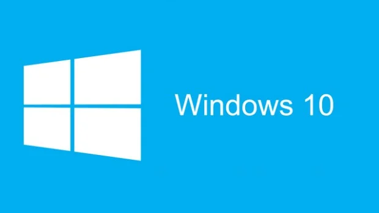

# TUTORIAL INSTALASI WINDOWS 10

[<- Back](https://github.com/alipbudiman/booting-dan-install-windows-serta-error-beep-pada-komputer)

## disusun oleh: Alif Budiman Wahabbi

---

---

# Windows 10

Windows merupakan sistem operasi yang dikembangkan oleh perusahaan teknologi asal Amerika Serikat, Microsoft. Sistem operasi Windows dirilis pertama kali pada tahun 1985 dan menjadi sistem operasi yang paling banyak digunakan di dunia. Windows 10 adalah versi terbaru dari sistem operasi Windows yang dirilis pada tahun 2015. Windows 10 memiliki berbagai fitur baru seperti Cortana, Microsoft Edge, dan sistem keamanan yang lebih baik. Sistem operasi ini juga mendukung berbagai perangkat seperti komputer desktop, laptop, tablet, dan smartphone. Windows 10 juga mendukung penggunaan aplikasi dan program dari Windows Store. Dengan fitur-fitur dan kemampuan yang lebih baik, Windows 10 menjadi pilihan yang tepat bagi pengguna yang membutuhkan sistem operasi yang dapat diandalkan dan mudah digunakan.

# link download windows

Kamu bisa mendownload windows10 [di sini](https://www.microsoft.com/en-us/software-download/windows10)

Kamu bisa download Rufus [di sini](https://rufus.ie/en/)

# Tutorial booting sistem operasi windows 10
Berikut ini adalah cara untuk melakukan booting pada sistem operasi Windows 10:

1. Persiapkan flashdisk dengan kapasitas sekitar 8GB untuk digunakan sebagai media installer Windows 10.
2. Unduh file installer ISO Windows 10 yang ingin digunakan.
3. Unduh aplikasi Rufus, yang digunakan untuk mengatur booting file ISO ke dalam flashdisk yang telah dipersiapkan.
4. Setelah semuanya siap, hubungkan flashdisk ke komputer atau laptop dan jalankan aplikasi Rufus.
5. Pilih perangkat flashdisk yang akan digunakan sebagai media installer Windows 10.

6. Pilih file ISO yang telah diunduh pada opsi boot selection.

7. Pilih standar instalasi Windows pada opsi image option.

8. Pilih partisi GPT dan sistem target UEFI pada opsi partisi.

9. Pilih sistem file NTFS dan ukuran default pada opsi file system.

10. Pilih opsi show advanced format.
11. Centang semua opsi yang tersedia.

12. Tekan tombol start dan ikuti instruksi untuk melakukan format pada flashdisk hingga selesai.

13. Tunggu proses booting selesai pada flashdisk.
14. Hubungkan flashdisk ke komputer atau laptop yang akan diinstall dengan Windows 10.
15. Restart komputer atau laptop dan tekan tombol F2 pada keyboard untuk masuk ke BIOS. Setiap laptop atau komputer memiliki cara yang berbeda untuk masuk ke BIOS.
16. Pilih tab Boot atau Boot Options.

17. Pilih perangkat flashdisk installer yang telah disiapkan sebagai prioritas booting. Cara memilihnya berbeda-beda tergantung laptop atau komputer yang digunakan. Ada yang menggunakan keyboard dan ada yang sudah bisa menggunakan mouse pada menu booting.

18. Simpan pengaturan dengan menekan tombol F10 kemudian Enter. Komputer akan menyimpan perubahan dan merestart kembali.

19. Tunggu hingga proses instalasi selesai. Setelah itu, komputer Anda siap digunakan dengan sistem operasi Windows 10 yang telah terinstal.

# Instalasi Windows 10
Berikut adalah cara melakukan instalasi Windows 10:

1. Setelah proses booting selesai, pengguna akan diarahkan ke halaman instalasi Windows.

2. Selanjutnya, pilih bahasa dan zona waktu, lalu tekan tombol "Next".

3. Tekan tombol "Install".

4. Kemudian, akan muncul aktivasi Windows. Jika Anda tidak memiliki nomor seri atau kunci produk, klik "I don't have a product key" atau "Skip".

5. Pilih sistem operasi Windows 10 Pro dari jendela yang muncul, lalu klik "Next".

6. Centang kotak persyaratan lisensi.

7. Pilih opsi "Custom install Windows".

8. Buat partisi pada hardisk. Misalnya, jika menggunakan SSD baru dengan kapasitas 256GB, partisi dapat dibuat menjadi dua bagian: partisi C dan D. Partisi C dibuat dengan kapasitas 128GB untuk sistem operasi, sementara partisi D digunakan untuk data lainnya.
9. Klik tombol "New" dan masukkan kapasitas 128GB, lalu klik "Apply" dan "OK".

10. Selanjutnya, klik drive yang terdapat pada partisi yang tersisa tanpa mengubah kapasitasnya, karena hanya dibuat dua partisi.
11. Pilih partisi yang berkapasitas 128GB atau partisi kedua yang diinginkan untuk menjadi tempat instalasi sistem operasi, yaitu partisi C, lalu klik "Next".

12. Tunggu hingga proses instalasi selesai.

13. Setelah selesai, tunggu hingga komputer merestart secara otomatis.
14. Setelah restart, muncul tampilan Windows 10. Ubah wilayah sesuai kebutuhan, lalu klik "Yes".
15. Selanjutnya, ikuti perintah yang muncul sesuai dengan jenis laptop yang digunakan.
16. Instalasi selesai.

# Menginstall dan update driver pada laptop atau pc:
Terdapat dua metode untuk menginstal dan mengupdate driver pada laptop atau PC, yaitu dengan cara otomatis dan cara manual. Berikut adalah cara menginstal dan mengupdate driver secara manual:

1. Pastikan laptop atau PC telah terhubung dengan internet.
2. Buka device manager.

3. Klik kanan pada device yang ingin diinstal atau diupdate drivernya.

4. Pilih "Properties".
5. Masuk ke tab "Details".
6. Salin hardware IDs.

7. Tempelkan pada situs pencari driver.
8. Pilih driver yang sesuai dengan laptop atau PC Anda.
9. Setelah selesai di-download, Anda dapat menginstal driver secara manual dan offline pada laptop.

10. Jika sudah selesai menginstal semua driver yang dibutuhkan, buka kembali device manager.
11. Klik kanan pada device yang ingin diinstal atau diupdate drivernya.
12. Pilih "Update driver".
13. Pilih pencarian online.

14. Update driver yang ada, jika ada yang terbaru maka akan muncul dan silahkan di-update. Jika sudah up-to-date, maka akan diberitahukan bahwa driver tersebut sudah terbaru.
15. Kemudian restart laptop atau PC Anda.
16. Tunggu proses restart selesai, dan laptop atau PC siap digunakan.

# Install dan update driver otomatis:

cara install dan update driver otomatis
1. download dan install driver pack solution

2. cari driver yg harus di update, biasanya akan lnsng otomatis scanning driver di laptop atau pc anda

3. install pembaharuan driver yg udh di scan tadi

4. tunggu proses hingga selesai

5. setelah selesai restart pc anda
6. lalu siap di gunakan

# Akhir kata
Dalam menggunakan komputer atau laptop, terkadang kita membutuhkan bantuan untuk mengatasi beberapa masalah teknis. Namun, dengan mengetahui beberapa langkah dasar seperti cara install dan update driver, atau cara menginstall sistem operasi, kita dapat memperbaiki masalah tersebut dengan mudah. Penting untuk selalu memperbarui driver dan sistem operasi agar perangkat kita selalu berfungsi dengan baik dan terhindar dari kerentanan keamanan. Semoga informasi ini bermanfaat bagi Anda dalam mengelola perangkat teknologi Anda.

---

[<- Back](https://github.com/alipbudiman/booting-dan-install-windows-serta-error-beep-pada-komputer)
